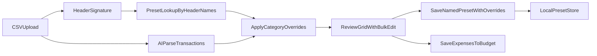

# AI Import Mapping Enhancement Plan

## Goal
Add reusable, named mapping presets for AI-based expense imports and enable post-parse bulk category edits that persist into future imports for the same mapping.

## Confirmed Requirements
- Matching strategy for applying a saved mapping: **header names only** (column positions can differ).
- Override persistence rule: **exact imported category name -> selected category**.
  - Example: `Online Shopping` (AI/import category) should always map to `Spend` for that mapping.
  - Rule applies only when imported category text matches exactly.

## Current Areas To Extend
- Import modal and review UX: [C:/Repos/budget-tracker/src/components/modals/AddExpenseModal.tsx](C:/Repos/budget-tracker/src/components/modals/AddExpenseModal.tsx)
- CSV mapping/preset utilities: [C:/Repos/budget-tracker/src/services/csvImportService.ts](C:/Repos/budget-tracker/src/services/csvImportService.ts)
- Shared domain types (if needed for new structures): [C:/Repos/budget-tracker/types.ts](C:/Repos/budget-tracker/types.ts)

## Proposed Design

### 1) Expand Mapping Preset Model
Add a richer preset model (stored in localStorage) with:
- `name`: user-provided preset name.
- `headerSignature`: normalized header-name set used for matching.
- `mapping`: date/description/amount/category column mapping.
- `categoryOverrides`: dictionary of exact imported category name -> final app category name.

Notes:
- Header signature uses normalized header names (trim/lowercase) and ignores position.
- Preset selection should auto-suggest when incoming headers match a saved signature.

### 2) AI Parse + Post-Parse Override Application
After AI parse results are returned:
- Keep both values per parsed row:
  - `importCategoryName` (AI/import category label)
  - `finalCategoryId`/`finalCategoryName` (category user will save)
- If a selected/auto-matched preset has `categoryOverrides`, apply them immediately to set default final category.

### 3) Import Review Bulk Category Editing
In parsed-expenses review table:
- Add row-selection checkboxes + select-all.
- Add bulk action controls:
  - choose target category
  - apply to selected rows
- Preserve per-row edits and bulk edits before save.

### 4) Save Mapping After AI Parse
Add explicit action in AI parse workflow:
- `Save Mapping` button with naming input.
- Save must capture:
  - current header-based mapping metadata
  - **effective category overrides derived from current review state**:
    - for each row where `importCategoryName` exists and selected final category differs, save rule `importCategoryName -> finalCategoryName`.
- On later imports with same header signature, auto-apply these overrides.

### 5) Guardrails and Edge Cases
- If duplicate override keys arise (same import category mapped differently in one review), resolve with last user-applied value and show warning before save.
- If a saved override points to a category that no longer exists, skip and leave unresolved for manual review.
- Do not apply overrides when import category is empty.

## Implementation Sequence
1. Extend preset schema and helper functions in [C:/Repos/budget-tracker/src/services/csvImportService.ts](C:/Repos/budget-tracker/src/services/csvImportService.ts).
2. Update parsed-row state model in [C:/Repos/budget-tracker/src/components/modals/AddExpenseModal.tsx](C:/Repos/budget-tracker/src/components/modals/AddExpenseModal.tsx) to track `importCategoryName` and final category separately.
3. Add bulk-select + bulk-category-change UI/logic in import review panel.
4. Implement `Save Mapping` (AI mode) to persist naming + effective overrides from reviewed rows.
5. Add auto-match/load behavior by header names and auto-apply overrides.
6. Add validation messaging + lightweight tests/manual verification checklist.

## Verification Checklist
- AI parse -> manual recategorize -> save mapping with name.
- Re-import from same institution format (same headers): preset auto-matches.
- `Online Shopping -> Spend` rule auto-applies on new import.
- Bulk-select and bulk-category-change works before final save.
- No regression to existing mapped parser or expense save flow.

## Data Flow (Target)

